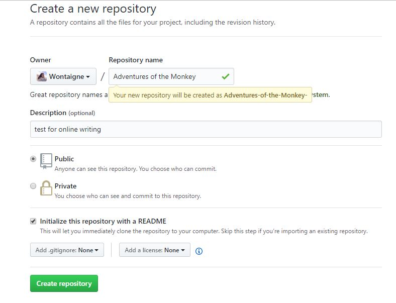
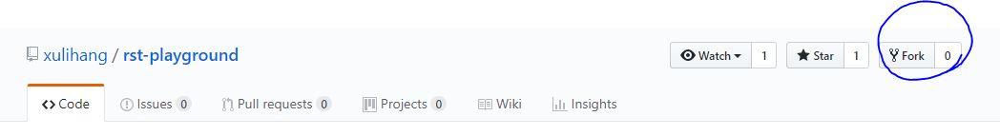
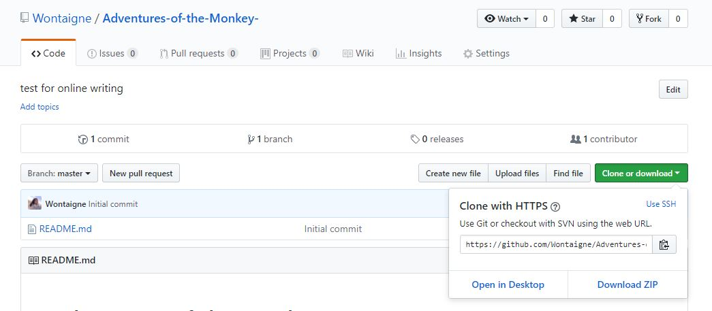
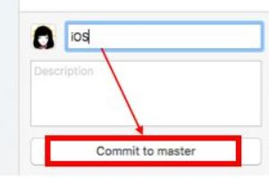

GitHub 在线写书
================
如果悟空，悟能，悟净要一起写一本《猴子历险记》，他们该怎么做呐？

1. 创建笔记本
^^^^^^^^^^^^^^^^^^^^^
    既然要写东西，先得有个本子，怎么办？创建一个笔记本，「repositories」就是你的笔记本们。

    |createrepo|

2. 借用笔记本
^^^^^^^^^^^^^^^^^^^^^
    如果你觉得吴承恩写的蛮不错，想把他的借用过来修改修改，改编成自己的版本，怎么办？ Fork！
    进入Repo主页，点击右上角的 fork

    |fork|

3. 下载笔记本
^^^^^^^^^^^^^^^^^^^^^
   笔记本存在云端，可是本地编辑才方便呐，怎么办？ Clone！进入 Repo，点击 Clone or download

   |clone|

   或者去客户端

4. 挥毫创作
^^^^^^^^^^^^^^^^^^^^^
   你的笔记本（Repo）默认创建了第一页，README.md.

   这个后缀名看上去怪怪的？这儿并不是缺省了t，md 是一种特殊的纯文本格式，你不仅要在文本里写文字，还要告诉它如何显示这些文字。有没有看过莎翁的剧本？对，就像剧本还要告诉演员怎么读台词一样，md 文件里你还要用标记写出你的文字如何展示。那样就不用像在 word 里编辑一样，写完内容还要调格式，发给别人还可能会乱码。学习 Markdown 基本语法，可以移步：https://www.jianshu.com/p/q81RER

   你可以在网页里直接编辑，或者在刚才 Clone 下载的文件夹里编辑。

5. 上传大作
^^^^^^^^^^^^^^^^^^^^^
   前十回终于写完了，你想上传给大家看看你的进度，怎么办呐？
   在客户端里，把这次创作修改的内容取好章节标题，点击下面的 Commit to master，还有右上角的 Sync， 齐活儿！
   |commit|

:author:
   黄文婷
:references:
   https://www.zhihu.com/search?type=content&q=github
:date:
   2018/4/24

